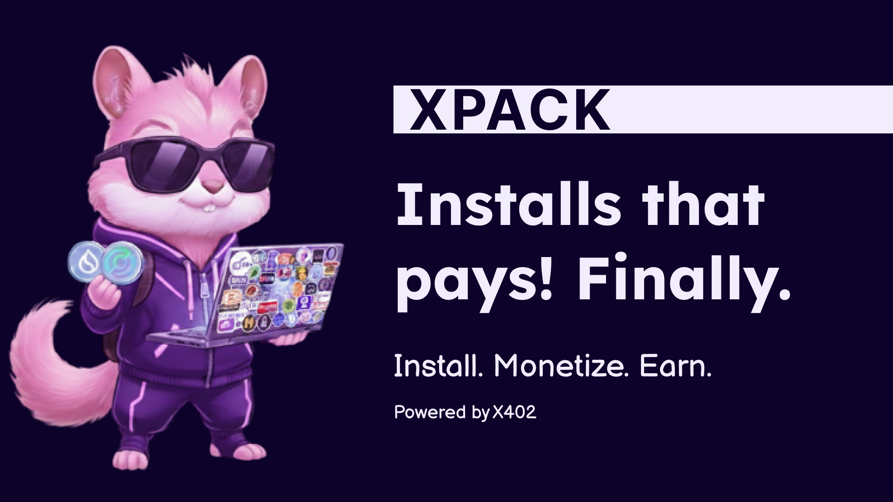

# Xpack - Installs that finally pays!!

##

**Xpack** is a crypto-native monetization platform for npm packages, making it easy for developers to get paid for open-source code—no custom backend or bank required. Just connect your wallet, add our config and preinstall script, and publish to npm. During install, users are prompted to pay with **FLOW** or **STARKNET (USDC)**, depending on their selected blockchain. Once payment is received on-chain, the install continues automatically. Xpack seamlessly links npm package distribution with direct payments, and gives authors a single dashboard for pricing, revenue, installs, and payment management across Flow and Starknet networks.

## Features

- **Frictionless for authors**: Start earning in minutes—connect your Web3 wallet, add your payment config and preinstall script, publish to npm, and get paid. No complex setup or private registries.

- **Pay at install**: Users pay with USDC (on supported EVM chains and Starknet), or FLOW (on Flow EVM chain) when they run `npm install`. Funds go straight to the author’s wallet and the install completes automatically, with no separate checkout or confusing flows.

- **Flexible pricing models**: Choose per-device, per-user, or subscription licensing, all configurable from your dashboard. Set your own prices and update anytime.

- **Multi-network payments**: Accept USDC on Starknet and EVM chains, and FLOW on Flow EVM chain. Expand your reach to users across leading blockchain ecosystems.

- **Real-time dashboard**: Track revenue, installs, and payments in one place. Manage your monetized packages and optimize your open-source business.

## Test packages

| Package                      | Description                |
| ---------------------------- | -------------------------- |
| **Starknet (USDC payments)** | `npm i xpack-starknet`     |
| **Flow EVM (FLOW)**          | `npm i xpack-flow`         |
| **Per-device pricing**       | `npm i xpack-per-device`   |
| **Per-user pricing**         | `npm i xpack-per-user`     |
| **Subscription pricing**     | `npm i xpack-subscription` |

## Why this matters

| Key Metric                        | Value / Impact                                                    |
| --------------------------------- | ----------------------------------------------------------------- |
| **2.6B+** weekly npm downloads    | Across 32M+ developers and businesses                             |
| **0** native monetization         | No built-in way to charge for npm packages today                  |
| **480K+** potential paid packages | A massive, untapped monetization opportunity across the ecosystem |

## Team

Meet the team behind Xpack:

- **Chandra Bose:** Full Stack Developer / [Twitter](https://x.com/Chandra_Bose31)
- **Shivathmika:** Full Stack Developer / [Twitter](https://x.com/_shivathmika)
- **Chetana:** Product Manager / [Twitter](https://x.com/fixerpabo_13)
