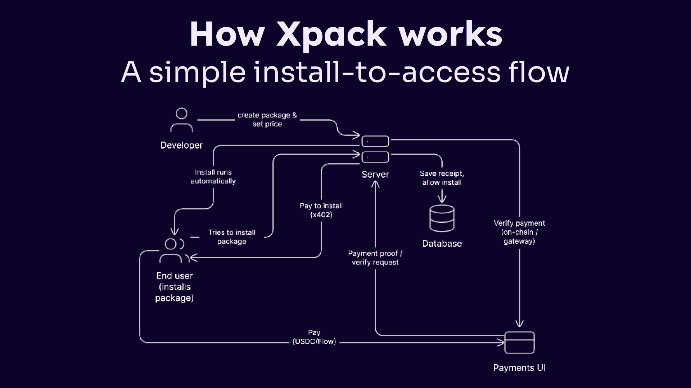

# Xpack — Crypto-Native Monetization for npm Packages

> **PL_Genesis: Frontiers of Collaboration Hackathon Submission**

## Table of Contents

- [What is Xpack?](#what-is-xpack)
- [The Problem](#the-problem)
- [How It Works](#how-it-works)
- [Features](#features)
- [Install Packages (Live Demos)](#install-packages-live-demos)
- [Hackathon Challenges](#hackathon-challenges)
- [Team](#team)

---

## What is Xpack?

Xpack is a crypto-native monetization platform for npm packages, making it easy for developers to get paid for open-source code — no custom backend or bank required.

Just connect your wallet, add our config and preinstall script, and publish to npm. During install, users are prompted to pay with **FLOW** or **USDC on Starknet**, depending on their selected blockchain. Once payment is received on-chain, the install continues automatically.

Xpack seamlessly links npm package distribution with direct on-chain payments, and gives authors a single dashboard for pricing, revenue, installs, and payment management across Flow and Starknet networks.

---

## The Problem

| Key Metric | Value |
|---|---|
| Weekly npm downloads | 2.6B+ across 32M+ developers |
| Native monetization in npm | **Zero** — no built-in way to charge for packages |
| Potential paid packages | 480K+ untapped monetization opportunities |

Open-source developers power the global software ecosystem yet have no native way to monetize their npm packages. Existing workarounds require custom backends, payment processors, and bank accounts — creating massive friction that leaves most open-source work uncompensated.

---

## How It Works

###
1. **Connect your Web3 wallet** to the Xpack dashboard
2. **Configure pricing** — choose per-device, per-user, or subscription licensing and set your price
3. **Add the preinstall script** to your `package.json`
4. **Publish to npm** as normal
5. **Get paid** — when someone runs `npm install`, they're prompted to pay on-chain. Once confirmed, the install completes automatically. Funds go straight to your wallet.

---

## Features

- **Frictionless for authors:** Start earning in minutes — no complex setup or private registries
- **Pay at install:** Users pay with USDC (Starknet / EVM chains) or FLOW (Flow EVM) at `npm install` time
- **Flexible pricing models:** Per-device, per-user, or subscription — all configurable from your dashboard
- **Multi-network payments:** USDC on Starknet and FLOW on Flow EVM chain
- **Real-time dashboard:** Track revenue, installs, and payments in one place

---

## Install Packages (Live Demos)

| Package | Network | Model | Price | Install Command |
|---|---|---|---|---|
| Per Device | Flow EVM | Per device | 1 FLOW | `npm i x-per-device` |
| Subscription Based | Flow EVM | Subscription | 1 FLOW | `npm i x-per-subscription` |
| Per User | Starknet | Per user | 0.1 USDC | `npm i x-per-usage` |

---

## Hackathon Challenges

### Existing Code Track — Protocol Labs
Xpack is an existing project meaningfully integrating partner bounties from Protocol Labs sponsors. We are submitting under the **Existing Code** track.

---

### Flow: The Future of Finance

Xpack lets you get paid in **FLOW** instantly when your npm package is installed. It's simple, automated, and works right in the terminal.

---

### Infrastructure & Digital Rights — Protocol Labs

Want to control how your open-source projects earn? Xpack does that—monetization, rights, and revenue, right from the blockchain.

---

### Crypto — Protocol Labs

We make it easy for you to accept crypto for your npm packages. No fees, no gatekeepers—just direct payments.

---

### Starknet — Privacy-Preserving Payments for npm

Xpack also works with **USDC on Starknet**. Quick, private payments for your code with zero friction.

---

### Funding the Commons

If you believe open source should be sustainable and open, Xpack is for you. Get funded, globally, without limits.

---

## Team

| Name | Role | Twitter |
|---|---|---|
| Chandra Bose | Full Stack Developer | [@Chandra_Bose31](https://x.com/Chandra_Bose31) |
| Shivathmika | Full Stack Developer | [@_shivathmika](https://x.com/_shivathmika) |
| Chetana | Product Manager | [@fixerpabo_13](https://x.com/fixerpabo_13) |

---

## Resources & Links

- **npm packages:** `x-per-device`, `x-per-subscription`, `x-per-usage`
- **Preview:** *(https://xpack-pl-genesis.vercel.app)*
- **GitHub:** *(https://github.com/chandrabosep/pl-genesis-xpack)*
- **Demo Video:** *(link)*

---

*Built at PL_Genesis: Frontiers of Collaboration · Existing Code Track*